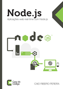

```
Roberto Nogueira  BSd EE, MSd CE
Solution Integrator Experienced - Certified by Ericsson
```

# Ral Time Apps with Nodejs



## Contents

```
Sumário

1 Bem-vindo ao mundo Node.js 1
[x] 1.1 O problema das arquiteturas bloqueantes
[ ] 1.2 E assim nasceu o Node.js
[ ] 1.3 Single-thread
[ ] 1.4 Event-Loop
[ ] 1.5 Instalação e configuração
[ ] 1.6 Gerenciando módulos com NPM
[ ] 1.7 Entendendo o package.json
[ ] 1.8 Escopos de variáveis globais
[ ] 1.9 CommonJS, Como ele funciona?

2 Desenvolvendo aplicações web 13
[ ] 2.1 Criando nossa primeira aplicação web
[ ] 2.2 Como funciona um servidor http?
[ ] 2.3 Trabalhando com diversas rotas
[ ] 2.4 Separando o HTML do Javascript
[ ] 2.5 Desafio: Implementar um roteador de url
[ ] 3 Por que o assíncrono? 21
[ ] 3.1 Desenvolvendo de forma assíncrona
[ ] 3.2 Assincronismo versus Sincronismo
[ ] 3.3 Entendendo o Event-Loop
[ ] 3.4 Evitando Callbacks Hell

4 Iniciando com o Express 31
[ ] 4.1 Por que utilizá-lo? 
[ ] 4.2 Instalação e configuração
[ ] 4.3 Criando um projeto de verdade
[ ] 4.4 Gerando scaffold do projeto
[ ] 4.5 Organizando os diretórios do projeto

5 Dominando o Express 43
[ ] 5.1 Estruturando views
[ ] 5.2 Controlando as sessões de usuários
[ ] 5.3 Criando rotas no padrão REST
[ ] 5.4 Aplicando filtros antes de acessar as rotas
[ ] 5.5 Indo além: criando páginas de erros amigáveis

6 Programando sistemas real-time 61
[ ] 6.1 Como funciona uma conexão bidirecional?
[ ] 6.2 Conhecendo o framework Socket.IO
[ ] 6.3 Implementando um chat real-time
[ ] 6.4 Organizando o carregamento de Sockets
[ ] 6.5 Socket.IO e Express em uma mesma sessão
[ ] 6.6 Gerenciando salas do chat
[ ] 6.7 Notificadores na agenda de contatos
[ ] 6.8 Principais eventos do Socket.IO

7 Integração com banco de dados 83
[ ] 7.1 Bancos de dados mais adaptados para Node.js
[ ] 7.2 MongoDB no Node.js utilizando Mongoose
[ ] 7.3 Modelando com Mongoose
[ ] 7.4 Implementando um CRUD na agenda de contatos
[ ] 7.5 Persistindo estruturas de dados com NoSQL Redis
[ ] 7.6 Mantendo um histórico de conversas do chat

8 Preparando um ambiente de testes 97
[ ] 8.1 Mocha, o framework de testes para Node.js
[ ] 8.2 Criando um Environment para testes
[ ] 8.3 Instalando e configurando o Mocha
[ ] 8.4 Rodando o Mocha no ambiente de testes
[ ] 8.5 Testando as rotas
[ ] 8.6 Deixando seus testes mais limpos

9 Aplicação Node em produção 111
[ ] 9.1 O que vamos fazer?
[ ] 9.2 Configurando Clusters
[ ] 9.3 Redis controlando as sessões da aplicação 
[ ] 9.4 Monitorando aplicação através de logs
[ ] 9.5 Otimizações no Express
[ ] 9.6 Otimizando requisições do Socket.IO
[ ] 9.7 Aplicando Singleton nas conexões do Mongoose
[ ] 9.8 Mantendo o sistema no ar com Forever
[ ] 9.9 Integrando Nginx no Node.js
10 Continuando os estudos 129
Índice Remissivo
```
